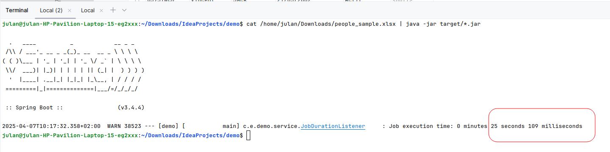

# Project Setup

## How to Launch

To run the application, follow these steps:

### 1. **With PostgreSQL Database:**
- Make sure you have a local PostgreSQL database running.
- Install the project with Maven:

   ```bash
   mvn clean install
  cat /path_to_file/people_sample.xlsx | java -jar target/*.jar
  ```

### 1. **Without PostgreSQL (using embedded H2 database):**
- If you want to run the application without PostgreSQL, you can use an embedded H2 database instead. To do so:
- In the pom.xml, replace the PostgreSQL dependency with the H2 dependency:
- 
 ```xml
<dependency>
  <groupId>com.h2database</groupId>
  <artifactId>h2</artifactId>
  <scope>runtime</scope>
</dependency
``` 
- Remove the PostgreSQL datasource configuration from application.properties.
- Then, you can run the application the same way:


```bash
   mvn clean install
  cat /path_to_file/people_sample.xlsx | java -jar target/*.jar
  ```


    

